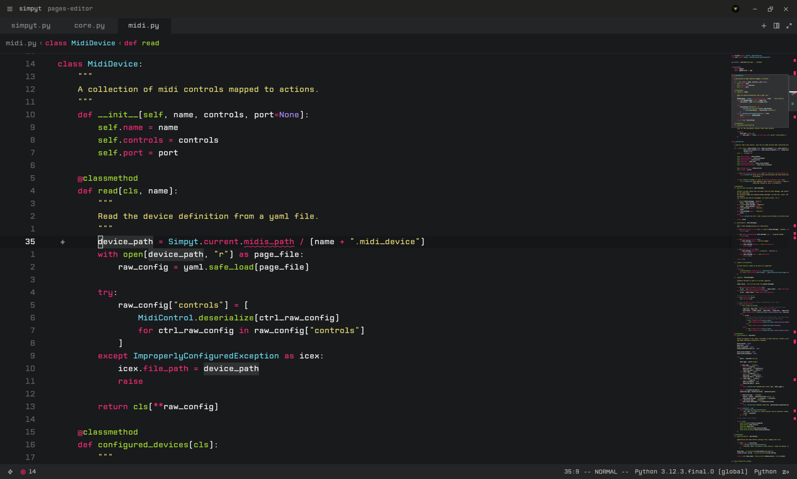

# Fisa Zed Config

My personal Zed configuration, inspired by my vim configs

# Installation

Just copy the `config` folder contents into your Zed config folder. 
In linux, that's `/home/YOUR_USER/.config/zed/`.

My config is using the CPMono_v07 font, which you can download here:
https://font.download/font/cpmonov07

And I'm using [Fish](https://fishshell.com/) as shell too.

Both things can be changed if you prefer other shells or fonts, editing the `config/settings.json` file.
